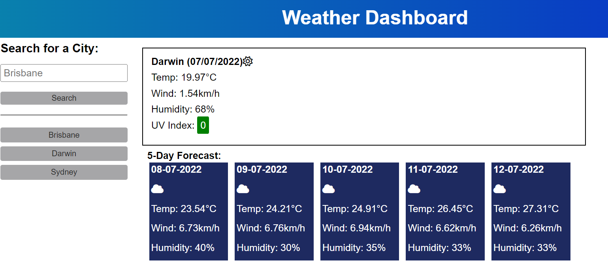

[Custom foo description](#foo)
[Custom foo description](#description)

# Foo

# Server-Side-APIs-Weather-Dashboard

# Description

The OpenWeather One Call API to retrieve and display weather data for cities.

# Planning Notes:

refer to this website for notes 2-4: https://coding-boot-camp.github.io/full-stack/apis/how-to-use-api-keys

1.  Create HTML and CSS general styling and structure before including the JS elements.
2.  Link the Weather Data APIs into variables in the js (APIKey, APICallCity etc.). Create click event for the users city input.
3.  Contruct a query URL and save into a variable queryURL.
4.  Impliment into an API call using Fetch - fetch(queryURL)
5.  Save the searched locations to local storage and have listed below the search bar for ease of user access.
    Bonus: Include in the users location to pull the info without them searching.

# Screenshots:

# Links:

GitHub: https://github.com/NessJade96/Server-Side-APIs-Weather-Dashboard
Deploy: https://nessjade96.github.io/Server-Side-APIs-Weather-Dashboard/

# Commit notes:

Commit 1:
Created repo, set up folders, html skeleton created with linked css and js. Started planning how to tackle this project. Wrote most of the CSS and placeholder HTML before starting on JS.

Commit 2:
Created variable names at the top of document - query selectors. Fetched the data from the weather application. User input set to local storage, displays the searched name and also created the search history buttons.

Commit 3:
Created the function the store the history of the city names to local storage - doesnt duplicate or anything. Just need to move these outside into smaller functions so it can be called on page load as well.

Commit 4:
create a function called renderHistoryButtons - this now shows the search history on page load and the buttons work to display the correct city.

Commit 5:
I ran into an issue where the first API call didnt fetch the UV index, I asked my classmates and was told I needed to do another API call to fetch this data. I have displayed the Temperature on the Daily forecast for now.

Commit 6:
The daily forecast is mostly done. Just need to do the UVI color box and the _sun_, _clouds_, etc. Icons. Will have to come back to this later.

Commit 7:
Downloaded a fontawesome kit, linked the style sheet and added in the icons for the weather. I also created CSS classes for the UVindex colored boxes.

Commit 8:
Created stlying for the 5-day forecast cards, added a forloop to loop through the 5-day forecast dates using moment.js and render those. All thats left is the rest of the weather information on the cards :)

Commit 9:
Added into the forloop the 5-day weather temp, humidity, wind etc. Also got the icons working :)
